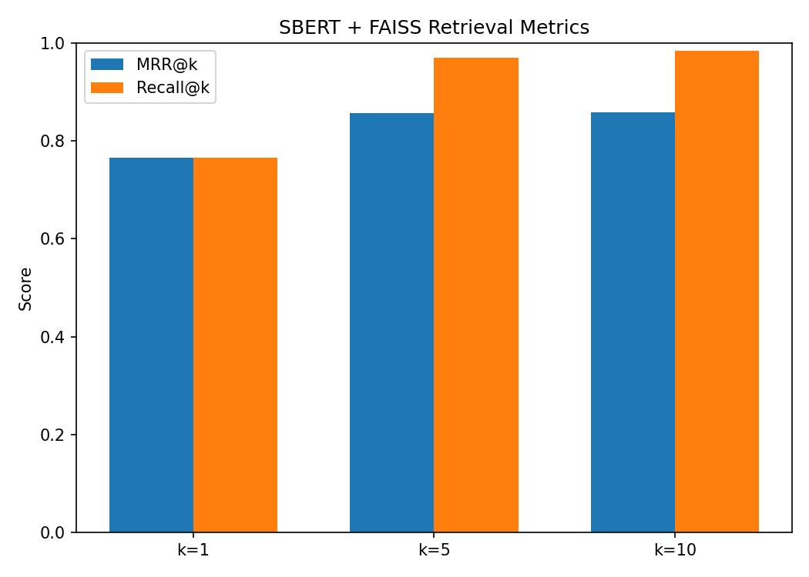

# Semantic Similarity Engine

Semantic search over MS MARCO passages: SBERT (`all-MiniLM-L6-v2`) embeddings, a FAISS index, evaluated with MRR/Recall@k against a keyword baseline.

## Problem

Keyword search fails on queries that are semantically equivalent but lexically different — *"heart disease prevention"* won't match a passage about *"cardiovascular risk reduction"* even though they mean the same thing. Dense embeddings fix this by placing text in a vector space where distance reflects meaning, not word overlap. It's also the core retrieval pattern behind every RAG pipeline (embed → index → nearest-neighbor search → feed to an LLM).

## Dataset

- **MS MARCO v1.1**: `load_dataset("microsoft/ms_marco", "v1.1", split="train[:15000]")`
- Corpus: 10,000 unique passages
- Eval set: 200 queries with a known answer passage (`is_selected` flag)

### A bug worth documenting

First pass deduped and capped the corpus independently of the eval set. `list(set(all_passages))[:10000]` truncates in arbitrary hash order, so most of the 200 eval answer passages never made it into the final corpus — Recall@10 was stuck around 0.10 regardless of retrieval quality, because the correct answer was often structurally absent from the index. No retrieval method can find an answer that isn't there.

Fix: cap the eval set first, then guarantee every one of those 200 answer passages is included in the corpus before filling the remaining ~9,800 slots. Recall@10 went from ~0.10 to ~0.99 after the fix — same retrieval code, same model, just a corpus that's actually consistent with what it's being evaluated against.

## Architecture

```
Query → SentenceTransformer (all-MiniLM-L6-v2) → 384-dim vector
                                                       ↓
Corpus (10K passages) → pre-encoded embeddings → FAISS IndexFlatIP
                                                       ↓
                                             Top-k passages + scores
```

Embeddings are L2-normalized before indexing. Once every vector has unit length, cosine similarity reduces to a plain dot product — so `IndexFlatIP` (inner product) gives cosine ranking without recomputing norms per query. The normalization cost is paid once at encoding time instead of on every search.

## Results

### SBERT + FAISS vs. keyword baseline

| Metric | Keyword Baseline | SBERT + FAISS |
|---|---|---|
| MRR@1 | 0.465 | 0.765 |
| MRR@5 | 0.543 | 0.857 |
| MRR@10 | 0.552 | 0.859 |
| Recall@5 | 0.675 | 0.970 |
| Recall@10 | 0.745 | 0.985 |
| Avg query latency | n/a | 16.8 ms |

Both clear the project targets (MRR@10 > 0.3, Recall@10 > 0.5). The keyword baseline does reasonably well here mainly because the corpus fix above guarantees every answer is retrievable at all — that's a property of the eval setup, not evidence that word overlap is a strong ranker.

### Latency (local CPU, 50 queries)

| Percentile | Latency |
|---|---|
| Avg | 16.8 ms |
| P50 | 8.8 ms |
| P95 | 11.7 ms |
| P99 | 210.7 ms |

Isolated: FAISS search ≈ 0.52 ms, query encoding ≈ 7.8 ms. Encoding dominates by roughly 15x — the index itself is close to free at this scale. The P99 spike looks like an occasional scheduling/cold-start hiccup rather than the search path.



## Key finding

The real gap isn't recall — both retrievers eventually surface the right passage in the top 10 (0.745 vs. 0.985). It's **ranking quality**: SBERT puts the correct answer at rank 1 much more often (MRR@1 0.465 → 0.765). That's the number that matters for RAG, where only the top few results usually get passed to the LLM.

One qualitative miss worth noting: "best programming language for beginners" pulled back passages about spoken/national languages, not programming. A 384-dim general-purpose embedding isn't domain-tuned, and ambiguous terms can pull in semantically-related-but-wrong results. Worth keeping in mind — the aggregate numbers above are an average over 200 queries of varying difficulty, not a guarantee every query performs this well.

## Scaling past 10K passages

`IndexFlatIP` is exact, brute-force — O(n) per query. That stops working around 1M+ passages:

- **IndexIVFFlat** — clusters vectors, searches only the nearest few clusters. Approximate, much faster.
- **IndexIVFPQ** — adds product quantization to shrink memory footprint.
- **Managed vector DB** (Pinecone, Weaviate, Qdrant) — handles sharding and incremental updates without hand-managing a FAISS index.
- At larger scale, search latency stops being negligible against encoding latency — both need re-profiling as the corpus grows, not just one or the other.

## Running it

```bash
pip install -r requirements.txt
```

Open `notebooks/semantic_similarity_engine.ipynb` and run top to bottom. Regenerates `index/corpus_index.faiss` and `index/passages.npy` — both gitignored, rebuilt from MS MARCO on each run rather than committed.

## Structure

```
Semantic Similarity Engine/
├── notebooks/
│   └── semantic_similarity_engine.ipynb
├── index/                      # gitignored — regenerate by running the notebook
│   ├── corpus_index.faiss
│   └── passages.npy
├── reports/
│   └── figures/
│       └── retrieval_metrics.png
├── requirements.txt
└── README.md
```
