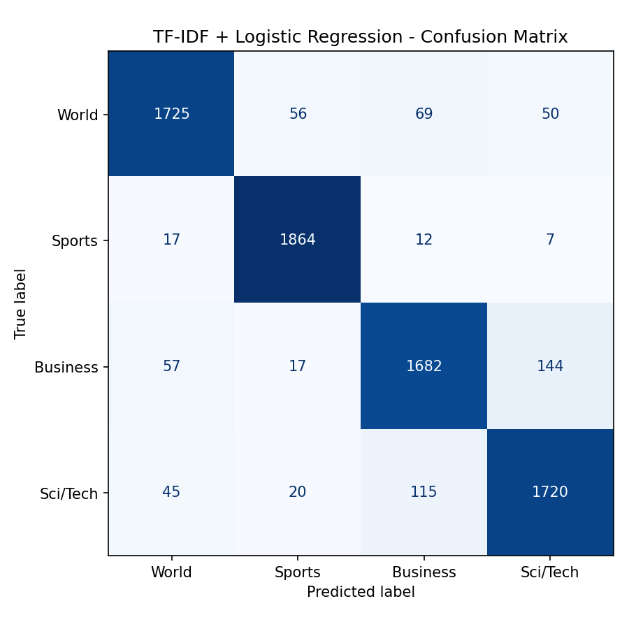

# DistilBERT News Classifier

## Problem Statement

News publishers and aggregators need to categorize incoming articles automatically and at scale — manual tagging can't keep up with volume. This project fine-tunes DistilBERT to classify news articles into one of four categories (World, Sports, Business, Sci/Tech) in milliseconds, and benchmarks it against a classical TF-IDF + Logistic Regression baseline to quantify what the transformer actually buys over a simpler approach.

## Dataset

**AG News** — a standard NLP classification benchmark assembled by ComeToMyHead from 2,000+ news sources.

| Property | Detail |
|---|---|
| Train size | 120,000 articles |
| Test size | 7,600 articles |
| Classes | 4 (balanced — 1,900 per class in test) |
| Input | Article title + description, concatenated |
| Source | `load_dataset("fancyzhx/ag_news")` |

| Label ID | Class | Description |
|---|---|---|
| 0 | World | International news, politics, conflict |
| 1 | Sports | All sports coverage |
| 2 | Business | Finance, economy, companies |
| 3 | Sci/Tech | Science and technology news |

## Architecture

- **Baseline:** TF-IDF (`max_features=50000`, `ngram_range=(1,2)`) + Logistic Regression (`C=1.0`, `max_iter=1000`)
- **Model:** `distilbert-base-uncased` + sequence classification head (`num_labels=4`) — 66,956,548 parameters
- **Tokenization:** `max_length=128`, `padding="max_length"`, `truncation=True` — sufficient for AG News' short title+description inputs
- **Training:** HuggingFace `Trainer` API, 3 epochs, AdamW (`lr=2e-5`, `weight_decay=0.01`), linear warmup/decay (`warmup_steps=500`), `EarlyStoppingCallback(patience=2)`
- **Tracking:** Weights & Biases (`report_to="wandb"`)

## Results

| Metric | TF-IDF + LR Baseline | DistilBERT Fine-tuned |
|---|---|---|
| Test Accuracy | 0.9199 | **0.9467** |
| World F1 | 0.9215 | 0.9586 |
| Sports F1 | 0.9666 | 0.9889 |
| Business F1 | 0.8904 | 0.9168 |
| Sci/Tech F1 | 0.9003 | 0.9226 |
| Training Time | 49.0s | 62.6 min (Colab T4) |

**DistilBERT improves ~2.7 points of accuracy over the baseline**, exceeding the ~93% target.

### Training curves

W&B logged loss and accuracy across the 3 epochs — training loss trended down and eval accuracy trended up each epoch, with no sign of overfitting by the point early stopping would have kicked in.

<p align="center">
  
  
</p>

### Confusion matrices

<p align="center">
  
  
</p>

### Key observation

**Business saw the largest F1 improvement** (0.8904 → 0.9168, +2.6 points), narrowly ahead of World (+3.7 points) and Sci/Tech (+2.2 points). Business and Sci/Tech are the two hardest classes for both models — they share vocabulary (companies, technology, markets) in a way World/Sports articles don't overlap with anything else. TF-IDF's bag-of-n-grams representation can't disambiguate "Apple reports record earnings" (Business) from "Apple unveils new chip" (Sci/Tech) as reliably as DistilBERT, which picks up contextual cues from word order and surrounding phrasing that n-grams miss.

## Sample Inference

Model reloaded from disk (independent of the training session) and tested on headlines it never saw during training:

| Headline | Predicted Class |
|---|---|
| "NASA announces new mission to explore the outer solar system" | Sci/Tech |
| "LeBron James leads Lakers to victory with a last-second shot" | Sports |
| "Federal Reserve raises interest rates amid inflation concerns" | Business |

All three predictions are correct.

## How to Run

1. Open `notebooks/distilbert_news_classifier.ipynb` in Google Colab (T4 GPU runtime recommended — CPU fine-tuning is impractical).
2. Run cells top to bottom. The first cell installs dependencies and removes a broken `torchvision` build that otherwise crashes the HuggingFace `datasets` torch formatter — **restart the runtime once after that cell runs**, then re-run from the top.
3. When prompted, log into W&B with your API key.
4. Drive gets mounted early on and all outputs (figures, saved model) are written directly into the synced project folder — no manual download step needed.

## W&B Run

[View the training run on W&B](https://wandb.ai/prasanthreddy030-/huggingface/runs/s9zuem7m)

## Project Structure

```
week6_distilbert_news_classifier/
├── notebooks/
│   └── distilbert_news_classifier.ipynb
├── reports/
│   └── figures/
│       ├── baseline_confusion_matrix.png
│       ├── distilbert_confusion_matrix.png
│       ├── Training Loss.png
│       └── Evaluation Accuracy.png
├── models/
│   └── distilbert-ag-news-final/
├── requirements.txt
└── README.md
```
